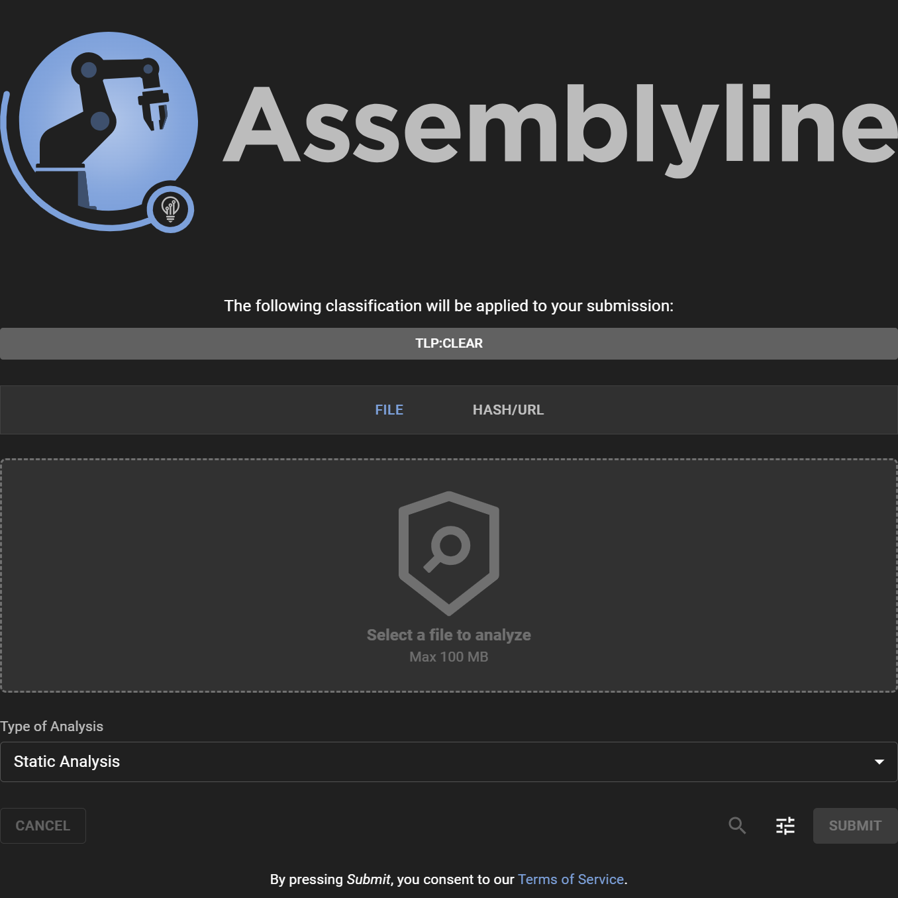
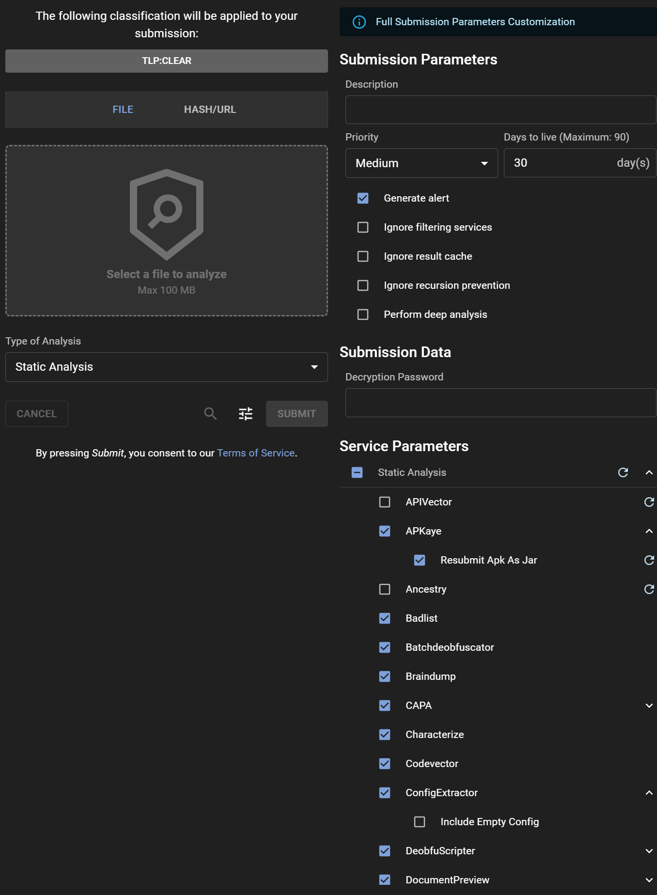

# Submitting a File for Analysis

## Submission Process

Submitting a file for analysis in Assemblyline is straightforward via the WebUI interface. For automated tasks and integration purposes, consider using the [REST API](../../integration/python/#submit-a-file-url-or-sha256-for-analysis).

### Sharing and Classification

Select the desired classification level or sharing restrictions by clicking on the Classification Banner, provided your system configuration includes TLP or another classification scheme.

### Selecting a File to be Analyzed

Upload a file for analysis either by clicking the "Select a file to analyze" button or using drag and drop into the designated dashed area.

### Choosing Analysis Type

Select the most suitable analysis type for your file from the "Type of Analysis" dropdown menu.

## Options

Access advanced submission options by clicking the "Tune" icon to open the "Adjust" panel. At the top, a banner indicates the level of customization privileges available to you. Users with the `submission_customize` role have the ability to modify all parameters, given that they understand the severe impact some parameters have on the system if miused.

### Submission Parameters

- **Description**: Optionally provide a description for the analysis, or leave it blank to accept the default value set by the system.
- **Priority**: Designate the submission's processing priority.
- **Days to live**: Specify how long (in days) the file should be retained in the system.
- **Generate alert**: Decide whether the submission should trigger an alert upon analysis completion.
- **Ignore filtering services**: Opt to bypass any safelisting services.
- **Ignore result cache**: Instruct the system to re-analyze the file, disregarding any recent similar analysis.
- **Ignore recursion prevention**: Remove iteration limits for the submission.
- **Perform deep analysis**: Engage thorough deobfuscation, recommended for confirmed malicious or highly suspicious files.

### Submission Data

- **Decryption Password**: Quickly input a password for encrypted files, bypassing the need to provide it to individual services.

### Service Parameters

- **Service categories**: Choose a preset group of services.
- **Specific service**: Manually select individual services for the analysis.
- **Service parameters**: Fine-tune service-specific parameters by expanding their individual menus.

### Submission Metadata

- **System Metadata**: Fill in required system-generated metadata fields.
- **Extra Metadata**: For those with full customization abilities, all additional metadata fields are editable.

## Understanding File Analysis

Upon submission, Assemblyline conducts several assessments to determine the optimal analysis path. Its recursive analysis capability is especially effective at peeling layers of obfuscation often found in malware, ultimately revealing underlying scripts or unpacked versions that can be more readily identified by traditional antivirus solutions.

