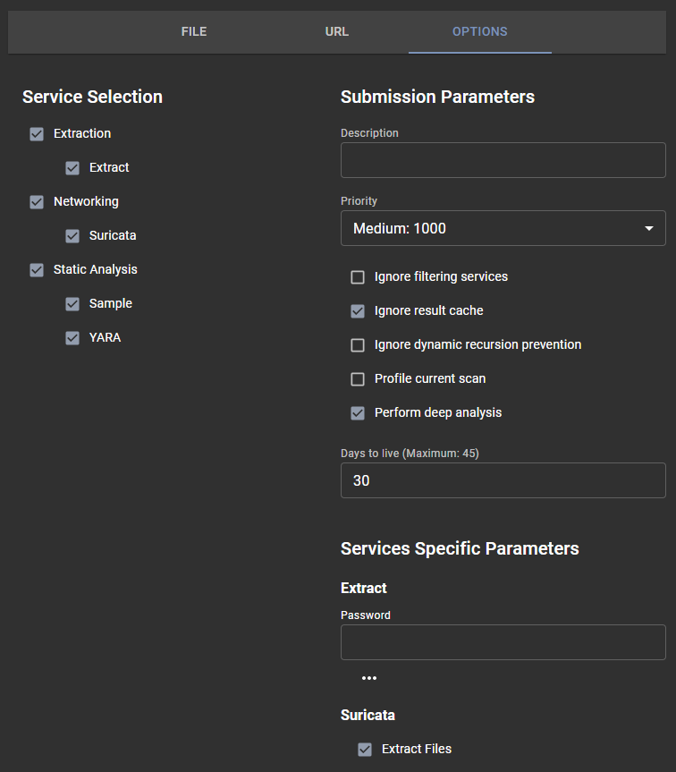

# Submitting a file for analysis

## Submission
Submitting a file for analysis is really easy; it can be done directly using the Assemblyline WebUI. For automation and integration you can use the [REST API](..assemblyline_client/#submit-a-file).

### Sharing and classification

If your system is configured with a sharing control (TLP) or Classification configuration; available restriction can be selected by clicking on the banner.

### Selecting a file to scan

You can click the "Select a file to scan" or drag and drop a file to the area to add a file to be analyzed.

## Options
Additional submission options are available to:

- select which service categories or specific services to use for the analysis. 
- specify service configuration options (such as providing a password, or dynamic analysis timeout).

| Ignore filtering services | Bypass whitelisting services |
| Ignore result cache | Force re-analysis even if the same file had been scanned recently with the same services version |
| Ignore dynamic recursion prevention | Disable iteration limit on a file |
| Profile current scan | |
| Perform deep analysis | Provide maximum deobfuscation - **Highly recommended for known malicious or highly suspicious file to detect highly obfuscated content** |
| Time to live | Time (in days) before the file is purged from the system |

## File analysis

Once a file is submitted to Assemblyline, the system will automatically perform multiple check to determine how to best process the file. One of Assemblyline most powerful functionality is its recursive analysis model. Malware and malicious documents often user multiple layers of obfuscation; recursive analysis allow the system to remove these layers and keep analyzing the file. The end results is often a cleartext script or unpacked malware which traditional anti-virus are very effective at detecting.

