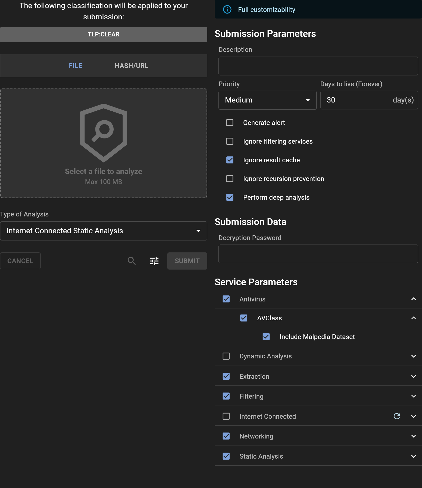

# Submitting a file for analysis

## Submission
Submitting a file for analysis is easy; it can be done directly using the Assemblyline WebUI. For automation and integration you can use the [REST API](../../integration/python/#submit-a-file-url-or-sha256-for-analysis).

### Sharing and classification
If your system is configured with a sharing control (TLP) or Classification configuration, the available restriction can be selected by clicking on the Classification Banner.

### Selecting a file to scan
You can click the "Select a file to analyze" or drag and drop a file to the area enclosed by the dashed line to add a file to be analyzed.

### Selecting the type of analysis to perform
You can clip on the "Type of Analysis" drop down menu and select the type of analysis to perform that is the most appropriate for your file.

## Options
Additionaly, open the "Adjust" panel to modify the submission and the services parameters by click on the "Tune" icon button. You'll notice at the top of the panel a banner indicating your customization priviledge. Some parameters usage have a severe impact on the system which can cause interruption of service if misused. As such, users who understand the risks and the implications of using those parameters will have the "submission_customize" role have access to modify them. For most users, using the default parameters are enough to get a basic understanding of the malware analysis. Here's an explaination of the parameters in each sections:

### Submission Parameters:
- **Description**: provide a description of the file being analyzed. Leave blank to let the system define the default description value
- **Priority**: priority in the queue
- **Days to live**: Time (in days) before the file is purged from the system
- **Generate alert**: Submission will trigger an alert on completion of analysis
- **Ignore filtering services**: Bypass safelisting services
- **Ignore result cache**: Force re-analysis even if the same file had been scanned recently with the same service versions
- **Ignore recursion prevention**: Disable iteration limit on a file
- **Perform deep analysis**: Provide maximum deobfuscation (**Highly recommended for known malicious or highly suspicious files to detect highly obfuscated content**)

### Submission Data:
- **Decryption Password**: This is a shortcut to enter a password if an input is password-protected instead of entering it in the corresponding services.

### Service Parameters:
- **Service categories**: You can select set of services by clicking on the service categories
- **Specific service**: You can select specific services by clicking on the specific services you want the analysis to use
- **Service parameters**: Services that have a collapsable icon can be clicked to open its list of parameters

### Submission Metadata:
-  **System Metadata**: The system's metadata fields can be entered here or must be entered if they are required
-  **Extra Metadata**: If there are extra metadata, users that can fully customize the submission can modify all the metadata fields

{: .center }

## File analysis
Once a file is submitted to Assemblyline, the system will automatically perform multiple checks to determine how to best
process the file. One of Assemblyline's most powerful functionalities is its recursive analysis model. Malware and
malicious documents often use multiple layers of obfuscation; recursive analysis allows the system to remove these
layers and keep analyzing the file. The result is often a cleartext script or unpacked malware which traditional
anti-virus are very effective at detecting.

{: .center }
