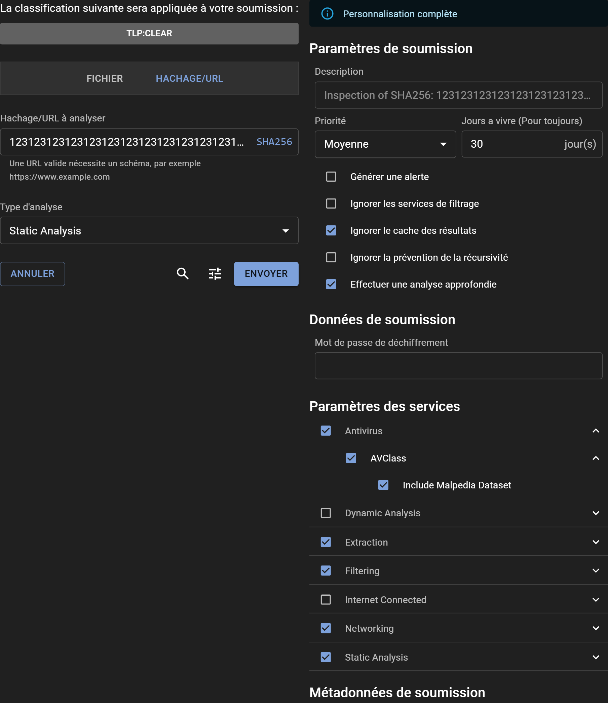

# Soumission d'un SHA256 pour Analyse

## Comment Soumettre un SHA256

Le processus de soumission d'un hash SHA256 est très similaire à celui d'une URL et peut être réalisé directement via l'interface utilisateur Web d'Assemblyline. Pour ceux qui souhaitent automatiser le processus ou l'intégrer à d'autres systèmes, l'[API REST](../../integration/python/#submit-a-file-url-or-sha256-for-analysis) est disponible. Il suffit de naviguer jusqu'à l'onglet "URL/SHA256" pour commencer.

### Niveau de Partage et Classification

Utilisez la bannière de Classification pour attribuer le niveau de partage approprié, tel que le Protocole de Feux de Circulation (TLP) ou un autre schéma de classification, à votre soumission.

### Soumettre un Hash SHA256

Entrez le hash SHA256 que vous souhaitez analyser dans la zone de texte "URL/SHA256 à scanner" et cliquez sur "SCAN" pour lancer le processus de soumission.

### Notes Importantes sur les Soumissions de SHA256

Lorsque vous soumettez un hash SHA256, Assemblyline vérifie si le hash correspond à un fichier précédemment rencontré. Si un fichier correspondant est trouvé, il est resoumis pour une analyse plus approfondie. Dans le cas contraire, si le fichier n'est pas trouvé dans le stockage local, Assemblyline tentera de le localiser sur une source externe, telle que Malware Bazaar, et le soumettra pour analyse s'il est trouvé.

Ce comportement dépend de votre configuration de déploiement — consultez [`submission.sha256_sources`](../../odm/models/config/#sha256source) pour les détails de configuration.

## Options

Accédez à des options de soumission avancées en cliquant sur l'icône "Ajuster" pour ouvrir le panneau "Options". En haut, une bannière indique le niveau de privilèges de personnalisation disponibles. Les utilisateurs ayant le rôle `submission_customize` ont la capacité de modifier tous les paramètres, à condition qu'ils comprennent l'impact sévère que certains paramètres peuvent avoir sur le système s'ils sont mal utilisés.

### Paramètres de Soumission

- **Description** : Fournissez éventuellement une description pour l'analyse, ou laissez-la vide pour accepter la valeur par défaut définie par le système.
- **Priorité** : Désignez la priorité de traitement de la soumission.
- **Durée de vie (jours)** : Spécifiez combien de temps (en jours) le fichier doit être conservé dans le système.
- **Générer une alerte** : Décidez si la soumission doit déclencher une alerte à la fin de l'analyse.
- **Ignorer les services de filtrage** : Choisissez de contourner tous les services de liste blanche.
- **Ignorer le cache des résultats** : Demandez au système de réanalyser le fichier, sans tenir compte d'une analyse similaire récente.
- **Ignorer la prévention de récursion** : Supprimez les limites d'itération pour la soumission.
- **Effectuer une analyse approfondie** : Procédez à une désobfuscation poussée, recommandée pour des fichiers confirmés malveillants ou hautement suspects.

### Données de Soumission

- **Mot de passe de déchiffrement** : Entrez rapidement un mot de passe pour les fichiers chiffrés, éliminant le besoin de le fournir à chaque service individuel.

### Paramètres des Services

- **Catégories de service** : Choisissez un groupe prédéfini de services.
- **Service spécifique** : Sélectionnez manuellement des services individuels pour l'analyse.
- **Paramètres des services** : Ajustez précisément les paramètres spécifiques à chaque service en développant leurs menus individuels.

### Métadonnées de Soumission

- **Métadonnées système** : Remplissez les champs de métadonnées générés par le système requis.
- **Métadonnées supplémentaires** : Pour ceux ayant des capacités de personnalisation complètes, tous les champs de métadonnées supplémentaires sont modifiables.

