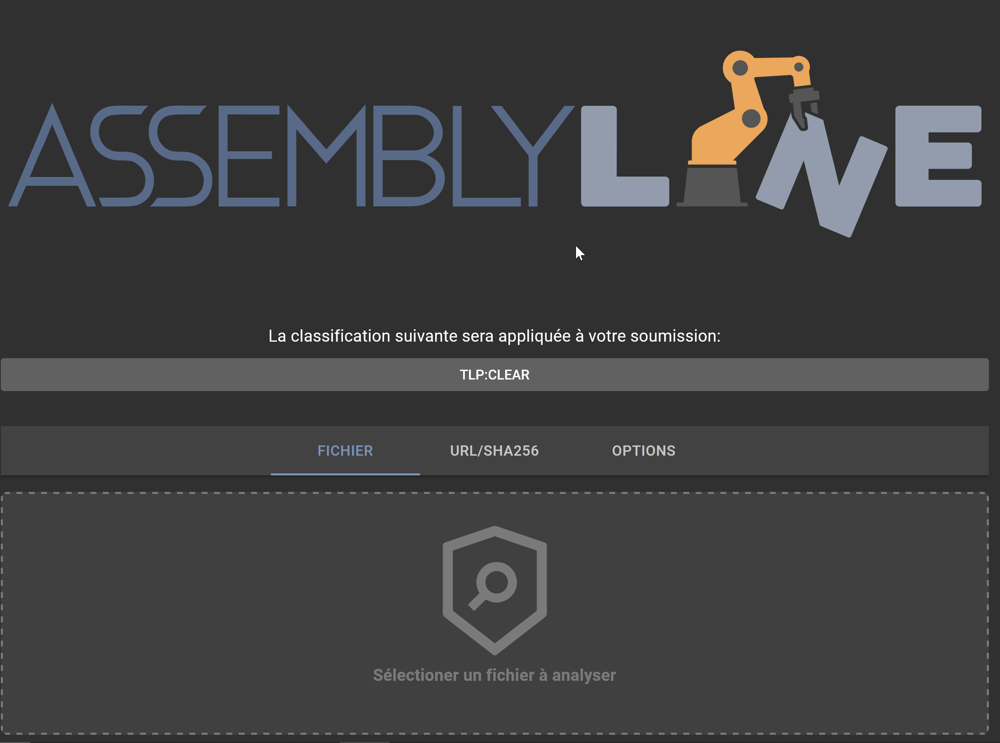

# Soummission d'un hash SHA256 pour l'analyse

## Soumission
Soumettre un SHA256 pour analyse est très similaire à la soummision d'un URL; cela peut être fait directement dans l'interface graphique web d'Assemblyline. Pour l'automatisation et l'intégration vous pouvez utiliser l'API. [REST API](../../integration/python/#submit-a-file-url-or-sha256-for-analysis).

Cliquez sur l'onglet "URL/SHA256".

### Partage et classification
Si votre systême est configuré avec le contrôle de partage(TLP) ou la classification  de configuration, les restrictions disponibles peuvent être selectionné en cliquant sur la bannière de classification.

### Choisir un SHA256 pour analyse
Contrairement à la soumission par fichier où un fichier est glisser ou selectionné du disque, il suffit d'entrer dans la zone de texte d'entrée le SHA256 que vous voulez analyser en le copiant/collant, puis cliquer sur "ANALYSER"!

### Note important par rapport aux soumissions SHA256 avec Assemblyline
Par défault, soumettre un hash SHA256 dans Assemblyline pour analyse mandatera Assemblyline de chercher dans le storage de fichier pour un fichier existant soumis précédement ayant ce hash. Si le fichier en question existe, Assemblyline resoumettra ce fichier pour l'analyse. Si ce fichier n'existe pas dans le storage, alors la soumission échouera ou Assemblyline tentera d'utiliser une source externe (si configuré) en cherchant l'existance de ce hash. Si le hash existe via la source externe comme Malware Bazaar, alors Assemblyline téléchargera le fichier via cette source et soumettra ce fichier pour analyse. Vous pouvez configurer ce paramètre dans votre déploiement k8s sous la section `ui`: https://cybercentrecanada.github.io/assemblyline4_docs/odm/models/config/#externalsource.

## Options
Options de soumission additionels non limité à:

- Choisir quelle(s) catégorie(s) de services ou quel(s) service(s) spécifique(s) à utiliser pour l'analyse
- Spécifier les paramètres de soumission des services (example: indiquer un mot de passe à utiliser, ou encore un temps limite pour l'analyse dynamique)
- Ignorer la filtration des services: Ne pas prendre compte des services de sûreté
- Ignoner les résultats en cache: Forcer la re-soumission même si le même fichier a été analyser récemment avec les mêmes versions de service
- Ignorer la prévention de la récurssion dynamique: Déactiver l'itération limite sur un fichier
- Profiler l'analyse courante
- Effectuer une analyse approfondie: Permet un decortiquate maximal (**Grandement recommendé pour les fichiers connus malveillants ou très suspicieux afin de détection le contenu camouflé**)
- Temps de vie: Temps (en jours) avant que le fichier soit effacé du système.

