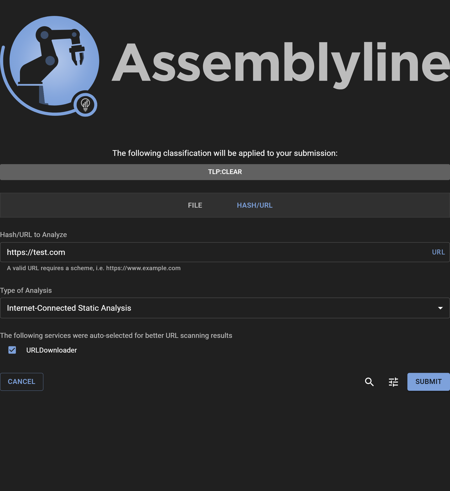

# Submitting a SHA256 for analysis

## Submission
Submitting a SHA256 for analysis is very similar to submitting a URL; it can be done directly using the Assemblyline WebUI. For automation and integration you can use the [REST API](../../integration/python/#submit-a-file-url-or-sha256-for-analysis).

Just click on the "URL/SHA256" tab.

### Sharing and classification
If your system is configured with a sharing control (TLP) or Classification configuration, the available restriction can be selected by clicking on the Classification Banner.

### Choosing a SHA256 to scan
Rather than dragging and dropping a file or selecting a file from your local drive, you input the SHA256 that you want to scan by typing/pasting it into the "URL/SHA256 To Scan" text box and clicking "SCAN"!

### An important thing to note about SHA256 submissions in Assemblyline
As a default, submitting a SHA256 hash to Assemblyline for analysis will prompt Assemblyline to check its file store to see if the SHA256 exists for any file that Assemblyline has previously seen. If the file exists, then Assemblyline will resubmit that file for analysis. If the file does not exist, then the submission will either fail or Assemblyline will use an external source (if configured) to query the existence of the hash. If the SHA256 is present on an external source like Malware Bazaar, then Assemblyline will download the file from that source and submit that file for analysis. You can set this up in your deployment configuration under the [`ui` component](../../odm/models/config/#externalsource).

## Options
Additional submission options are available to:

- Select which service categories or specific services to use for the analysis
- Specify service configuration options (such as providing a password, or dynamic analysis timeout)
- Ignore filtering services: Bypass safelisting services
- Ignore result cache: Force re-analysis even if the same file had been scanned recently with the same service versions
- Ignore dynamic recursion prevention: Disable iteration limit on a file
- Profile current scan
- Perform deep analysis: Provide maximum deobfuscation (**Highly recommended for known malicious or highly suspicious files to detect highly obfuscated content**)
- Time to live: Time (in days) before the file is purged from the system

{: .center }
