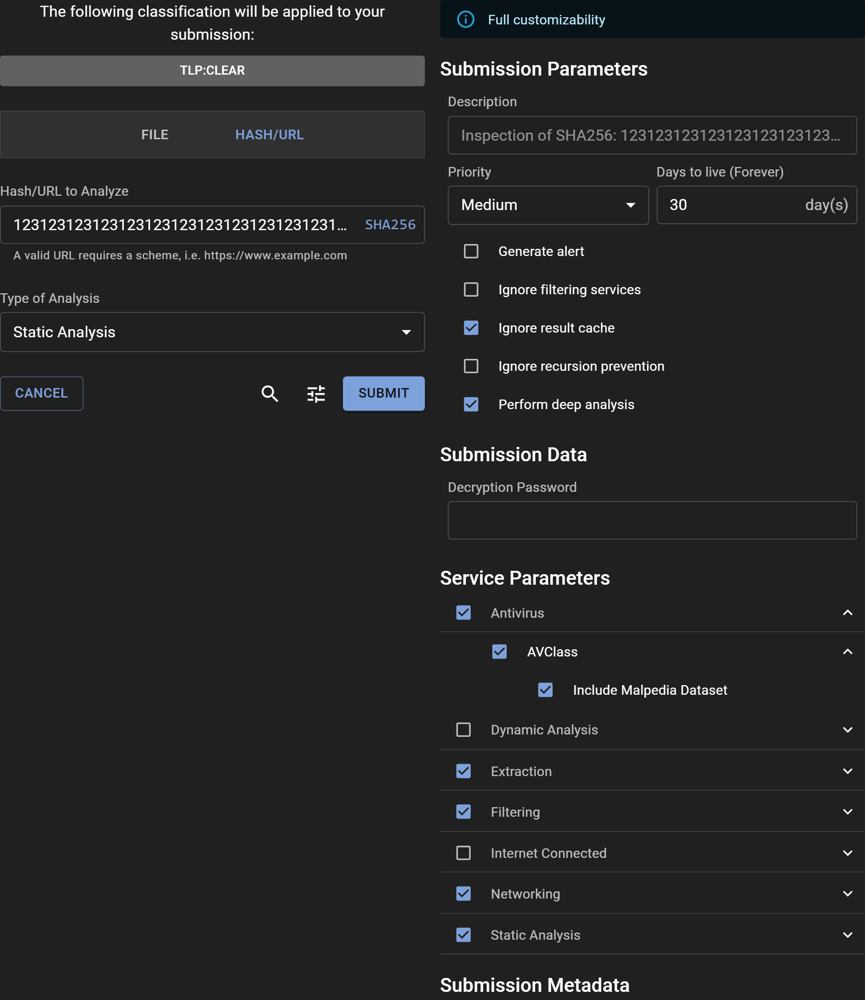

# Submitting a SHA256 for Analysis

## How to Submit a SHA256

The process to submit a SHA256 hash is very similar to submitting a URL and can be accomplished directly through the Assemblyline WebUI. For those looking to automate the process or integrate with other systems, the [REST API](../../integration/python/#submit-a-file-url-or-sha256-for-analysis) is available. Simply navigate to the "URL/SHA256" tab to begin.

### Share Level and Classification

Use the Classification Banner to assign the appropriate sharing level, such as Traffic Light Protocol (TLP) or another classification scheme, to your submission.

### Submitting a SHA256 Hash

Enter the SHA256 hash you want to analyze into the "URL/SHA256 To Scan" textbox and click "SCAN" to start the submission process.

### Important Notes on SHA256 Submissions

When you submit a SHA256 hash, Assemblyline checks if the hash matches any file previously encountered. If a match is found, it resubmits the file for further analysis. Alternatively, if the file isn't found in the local store, Assemblyline will attempt to locate it on an external source, such as Malware Bazaar, and submit it for analysis if found.

This behavior depends on your deployment configuration—see [`submission.sha256_sources`](../../odm/models/config/#sha256source) for setup details.

## Options

Access advanced submission options by clicking the "Tune" icon to open the "Adjust" panel. At the top, a banner indicates the level of customization privileges available to you. Users with the `submission_customize` role have the ability to modify all parameters, given that they understand the severe impact some parameters have on the system if miused.

### Submission Parameters

- **Description**: Optionally provide a description for the analysis, or leave it blank to accept the default value set by the system.
- **Priority**: Designate the submission's processing priority.
- **Days to live**: Specify how long (in days) the file should be retained in the system.
- **Generate alert**: Decide whether the submission should trigger an alert upon analysis completion.
- **Ignore filtering services**: Opt to bypass any safelisting services.
- **Ignore result cache**: Instruct the system to re-analyze the file, disregarding any recent similar analysis.
- **Ignore recursion prevention**: Remove iteration limits for the submission.
- **Perform deep analysis**: Engage thorough deobfuscation, recommended for confirmed malicious or highly suspicious files.

### Submission Data

- **Decryption Password**: Quickly input a password for encrypted files, bypassing the need to provide it to individual services.

### Service Parameters

- **Service categories**: Choose a preset group of services.
- **Specific service**: Manually select individual services for the analysis.
- **Service parameters**: Fine-tune service-specific parameters by expanding their individual menus.

### Submission Metadata

- **System Metadata**: Fill in required system-generated metadata fields.
- **Extra Metadata**: For those with full customization abilities, all additional metadata fields are editable.

