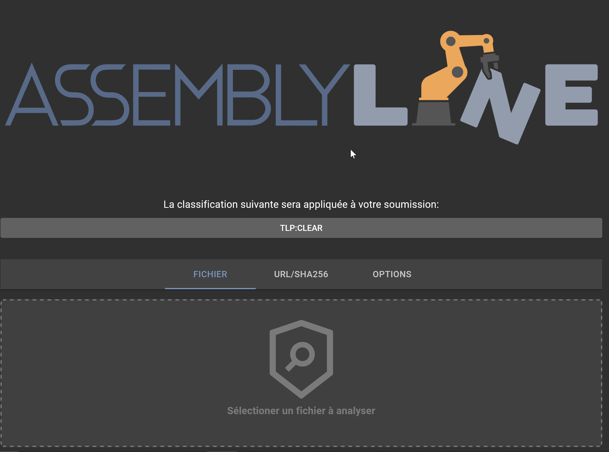
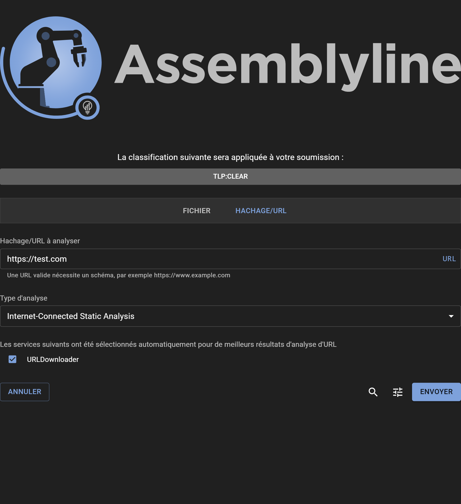
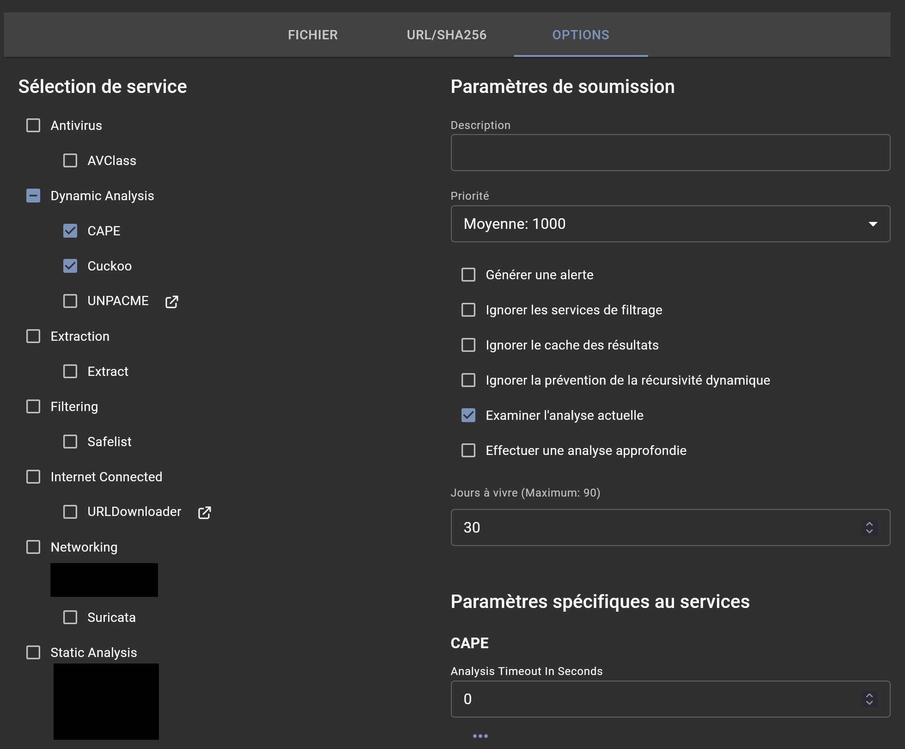

# Soumission d'un lien URL pour l'analyse

## Soumission
Soumettre un lien URL pour analyse est très similaire à la soumission de fichier; cela peut être fait directement dans l'interface graphique web d'Assemblyline. Pour l'automatisation et l'intégration il est possible d'utiliser l'API [REST API](../../integration/python/#submit-a-file-url-or-sha256-for-analysis).



Cliquer sur l'onglet "URL/SHA256".



### Partage et classification
Si votre systême est configuré avec le contrôle de partage(TLP) ou la classification  de configuration, les restrictions disponibles peuvent être selectionné en cliquant sur la bannière de classification.

### Choisir un URL pour analyse
Contrairement à la soumission par fichier où un fichier est glisser ou selectionné du disque, il suffit d'entrer dans la zone de texte d'entrée le lien URL que vous voulez analyser en le copiant/collant, puis cliquer sur "ANALYSER"!

### Note important par rapport aux soumissions d'URL dans Assemblyline
Soumetter une URL à travers l'interface web ou le client crée un fichier URI qui sera utilisé comme fichier initial dans une nouvelle soumission. Il est aussi possible de manuellement créer ce fichier afin de le soumettre à votre instance comme n'importe quel autre fichier. Le but d'un type de fichier URI dynamique est d'ouvrir la possibilité à des utiliser des services allant chercher de l'information sur des resources externe au système. L'utilisation principale est faite à travers des liens http et https qui peuvent héberger du contenu malicieux tel que la second phase d'une chaine d'exploitation. Lorsqu'un fichier URI est soumis, les bon services doivent être sélectionnés pour maximiser l'efficacité d'Assemblyline. Dans le cas d'un fichier http ou https, nous recommandons le module nommé URLDownloader.

### Le type de fichier URI
Un fichier URI doit au minimum suivre la structure suivante:
```yaml
# Assemblyline URI file
uri: <schéma>://<hôte>
```
Un fichier URI est un fichier yaml qui peut contenir plusieurs éléments supplémentaires afin de donner plus de détails aux modules pouvant les utiliser. Les deux portions les plus importantes sont la clé "uri", qui doit contenir un uri valide avec un schéma et un hôte, ainsi que le commentaire sur la première ligne, pour aider avec l'identification du fichier. Le schéma sera utilisé dans l'identification pour créer le type de fichier. Si le fichier contient `uri: http://site.com`, il sera identifié comme `uri/http` et s'il contient `uri: ftp://site.com`, il sera alors identifié comme `uri/ftp`. Cette distinction entre les fichiers URI permettent d'envoyer facilement les bons fichiers aux modules selon ce qu'ils peuvent faire. Dans le cas d'un fichier `uri/ftp`, il serait possible d'utiliser les éléments supplémentaire pour passer des informations importantes tel que le mode du server, en utilisant `passive: True`.

Voici un autre example plus complet pour un fichier d'URI:
```yaml
# Assemblyline URI file
uri: https://mb-api.abuse.ch/api/v1/
data: query=get_info&hash=52307f9ce784496218f2165be83c2486ad809da98026166b871dc279d40a4d1f
headers:
  Content-Type: application/x-www-form-urlencoded
method: POST
```
Ce fichier serait identifié comme fichier `uri/https` et les autres clés seront ignorées lors de l'identification. Les clés supplémentaires seront utilisés par URLDownloader pour effectuer les actions avec le plus de précision quant aux demande de l'utilisateur, ou du service ayant créé le fichier URI. Il serait possible d'y spécifier un user-agent, un referer ou un autre en-tête afin de respecter certains requis pour obtenir le fichier suivant d'un serveur qui filtre ses requêtes. À travers ces clés supplémentaires, il est possible de spécifier des méthodes tel que POST. Dans l'exemple précédent, il suffit de changer `query=get_info` à `query=get_file` afin de télécharger le fichier de MalwareBazaar!

Étant donné que les fichiers d'URI sont spécifiques à Assemblyline, chaque fichier est ré-écrit lorsqu'il est envoyé à l'instance afin de s'assurer d'avoir le commentaire sur la première ligne, puis la clé `uri`, pour ensuite avoir toutes les clés supplémentaires dans l'ordre alphabetique. Cette ré-écriture est faite pour dé-dupliquer les fichiers qui peuvent être considérés identiques et optimiser la cache de résultats. Une clé telle que `extra_key: ["first", "second", "third", "fourth"]` garder le même ordre, mais sera convertie comme suit:
```yaml
extra_key:
- first
- second
- third
- fourth
```

### Fichiers URI et proxies
Pour le moment, chaque module a besoin d'être configuré individuellement lorsqu'il est nécessaire de passer au travers d'un proxy. Le service URLDownloader peut être configuré pour supporter plusieurs proxies, ce qui donne le choix du proxy à l'utilisateur lors de la soumission. Dans le futur, il est planifié de normaliser la gestion des proxies dans Assemblyline afin d'avoir une configuration générale qui sera utilisée par tous les modules ayant besoin d'y accéder.

Ceci est important car si vous avez un URL qui héberge un fichier malveillant et que vous ne voulez pas exposer votre système Assemblyline au serveur auquel le URL pointe, il est recommandé de configurer un serveur proxy qui agira comme intermédiaire entre l'architecture d'Assemblyline et le serveur qui héberge un fichier malveillant. Vous pouvez configurer ce paramètre dans votre déploiement k8s sous la section `ui`: https://cybercentrecanada.github.io/assemblyline4_docs/odm/models/config/#ui. Le paramètre en question est `url_submission_proxies`.

## Options
Options de soumission additionels non limité à:

- Choisir quelle(s) catégorie(s) de services ou quel(s) service(s) spécifique(s) à utiliser pour l'analyse
- Spécifier les paramètres de soumission des services (example: indiquer un mot de passe à utiliser, ou encore un temps limite pour l'analyse dynamique)
- Ignorer la filtration des services: Ne pas prendre compte des services de la liste sûre
- Ignoner les résultats en cache: Forcer la re-soumission même si le même fichier a été analyser récemment avec les mêmes versions de service
- Ignorer la prévention de la récurssion dynamique: Déactiver l'itération limite sur un fichier
- Profiler l'analyse courante
- Effectuer une analyse approfondie: Permet un decortiquate maximal (**Grandement recommendé pour les fichiers connus malveillants ou très suspicieux afin de détection le contenu camouflé**)
- Temps de vie: Temps (en jours) avant que le fichier soit effacé du système.


