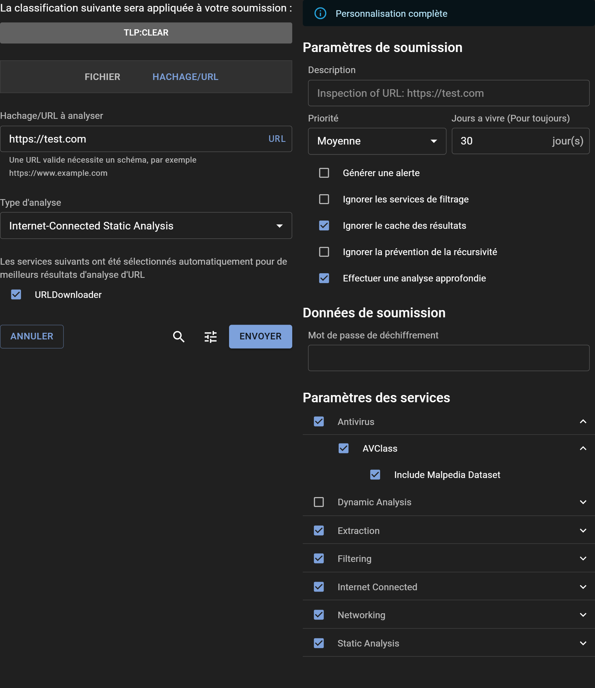

# Soumission d'une URL pour Analyse

## Comment Soumettre une URL

La soumission d'une URL à Assemblyline pour une analyse peut être effectuée directement par le biais de l'interface WebUI, tout comme la soumission d'un fichier. Pour l'automatisation et l'intégration avec d'autres systèmes, utilisez l'[API REST](../../integration/python/#submit-a-file-url-or-sha256-for-analysis).


### Niveau de Partage et de Classification

Si un système de classification tel que le Protocole TLP (Traffic Light Protocol) ou un système similaire est configuré sur votre plateforme, vous pouvez sélectionner les restrictions de partage appropriées à l'aide de la bannière de Classification.

### Détails de la Soumission d'URL

Entrez l'URL que vous souhaitez analyser dans la zone de texte "URL/SHA256 à scanner" et cliquez sur "SCAN".

### Informations Importantes Concernant les Soumissions d'URL

La soumission d'une URL crée un fichier URI qui sert de point d'entrée pour l'analyse. Assemblyline peut également interagir avec des ressources externes, comme récupérer une charge utile de seconde phase à partir d'un lien HTTP/HTTPS trouvé dans un fichier malveillant. Pour réussir la récupération d'un URI, des services pertinents tels que le service URLDownloader doivent être sélectionnés.

### Structure de Fichier URI

Un fichier URI est un fichier YAML avec une structure de base comme celle-ci :

```yaml
# Fichier URI Assemblyline
uri: <scheme>://<host>
```

C'est un fichier YAML qui peut contenir plus d'éléments pour des cas d'utilisation où les services peuvent les exploiter. Les parties les plus importantes sont la clé "uri" dans le fichier YAML, qui doit être une URI valide avec un schéma et un hôte, et le commentaire en haut, pour aider à l'identification. Le schéma sera utilisé pour créer le type de fichier ; donc, si vous utilisez `uri: http://site.com`, cela sera un fichier de type `uri/http` et si vous utilisez `uri: ftp://site.com`, alors vous aurez un `uri/ftp`. Cela permettra de diriger vers différents services en fonction du schéma. Dans le cas de `uri/ftp`, vous aurez probablement besoin de plus d'informations, telles que des clés YAML comme `passif:True`.

Voici un exemple plus complet et complexe d'un fichier URI :

```yaml
# Fichier URI Assemblyline
uri: https://mb-api.abuse.ch/api/v1/
data: query=get_info&hash=52307f9ce784496218f2165be83c2486ad809da98026166b871dc279d40a4d1f
headers:
  Content-Type: application/x-www-form-urlencoded
method: POST
```

Le type de fichier serait `uri/https` et les autres clés YAML seront ignorées lors de l'identification. Les clés supplémentaires dans le fichier YAML peuvent être utilisées par le service qui traite ce fichier spécifique pour fournir un comportement plus personnalisé, plus proche de ce que l'utilisateur demande. Un user-agent spécifique, un referer ou d'autres en-têtes pourraient être utilisés pour récupérer une seconde étape d'un serveur qui nécessiterait des valeurs spécifiques. Grâce à ces valeurs supplémentaires, URLDownloader prend désormais en charge des méthodes plus variées comme POST. Un changement simple de `query=get_info` à `query=get_file` dans les données et le service devrait être en train de télécharger ce fichier depuis MalwareBazaar !

Étant donné que les fichiers URI sont très spécifiques à Assemblyline, nous prenons le temps de réécrire tout fichier entrant pour que le commentaire `# Fichier URI Assemblyline` soit sur la première ligne, suivi de la clé uri, puis de toutes les autres clés dans l'ordre alphabétique. Ceci est fait pour dédupliquer les fichiers "identiques" et utiliser la mise en cache. Une clé comme `extra_key: ["premier", "deuxième", "troisième", "quatrième"]` conservera son ordre et sera convertie comme suit :

```yaml
extra_key:
- premier
- deuxième
- troisième
- quatrième
```

### Fichiers URI et Proxies

Actuellement, chaque service qui nécessite de passer par un proxy doit être configuré par un administrateur. URLDownloader prend en charge les proxies et peut même être configuré pour permettre à un utilisateur de choisir parmi plusieurs proxies configurés. À l'avenir, nous envisagerons de normaliser cette fonctionnalité afin que tous les services puissent utiliser une sélection centrale de proxy.

Cela est important car si vous avez une URL hébergeant un logiciel malveillant et que vous ne souhaitez pas exposer votre système Assemblyline à ce serveur, alors nous vous recommandons de configurer un serveur proxy pour agir comme intermédiaire entre votre infrastructure Assemblyline et le serveur hébergeant le logiciel malveillant. Vous pouvez configurer cela dans la configuration de votre déploiement sous le composant [`ui`](../..//odm/models/config/#ui). L'élément que vous recherchez est `url_submission_proxies`.

## Options

Accédez à des options avancées de soumission en cliquant sur l'icône "Ajuster" pour ouvrir le panneau "Réglages". En haut, une bannière indique le niveau de privilèges de personnalisation disponibles pour vous. Les utilisateurs avec le rôle `submission_customize` ont la capacité de modifier tous les paramètres, à condition qu'ils comprennent l'impact sévère que certains paramètres peuvent avoir sur le système s'ils sont mal utilisés.

### Paramètres de Soumission

- **Description** : Fournissez éventuellement une description pour l'analyse, ou laissez-la vide pour accepter la valeur par défaut définie par le système.
- **Priorité** : Désignez la priorité de traitement de la soumission.
- **Durée de vie (jours)** : Spécifiez combien de temps (en jours) le fichier doit être conservé dans le système.
- **Générer une alerte** : Décidez si la soumission doit déclencher une alerte à la fin de l'analyse.
- **Ignorer les services de filtrage** : Choisissez de passer outre les services de liste blanche.
- **Ignorer le cache de résultats** : Demandez au système de réanalyser le fichier, en ignorant toute analyse similaire récente.
- **Ignorer la prévention de récursion** : Supprimez les limites d'itération pour la soumission.
- **Effectuer une analyse approfondie** : Engagez une désobfuscation complète, recommandée pour des fichiers confirmés malveillants ou hautement suspects.

### Données de Soumission

- **Mot de passe de déchiffrement** : Entrez rapidement un mot de passe pour les fichiers chiffrés, évitant la nécessité de le fournir à chaque service individuellement.

### Paramètres des Services

- **Catégories de services** : Choisissez un groupe prédéfini de services.
- **Service spécifique** : Sélectionnez manuellement des services individuels pour l'analyse.
- **Paramètres des services** : Ajustez précisément les paramètres spécifiques à chaque service en développant leurs menus individuels.

### Métadonnées de Soumission

- **Métadonnées système** : Remplissez les champs métadonnées générés par le système comme requis.
- **Métadonnées supplémentaires** : Pour ceux possédant des capacités de personnalisation totales, tous les champs de métadonnées supplémentaires sont modifiables.


