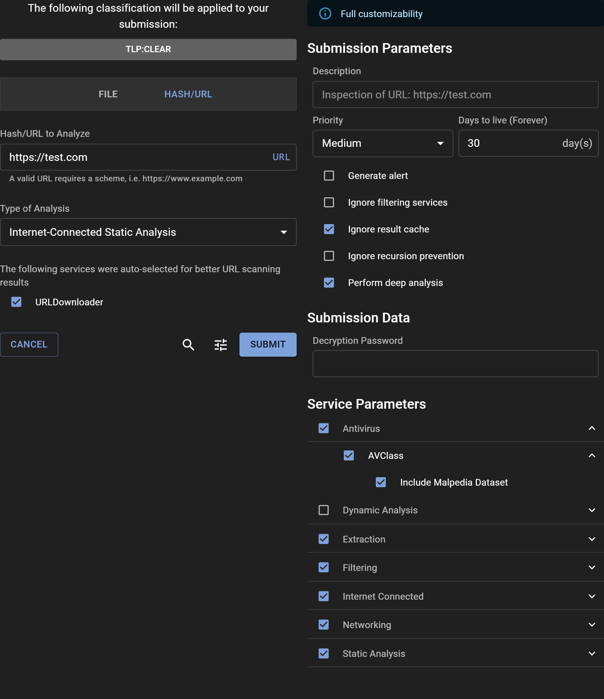

# Submitting a URL for Analysis

## How to Submit a URL

Submitting a URL to Assemblyline for analysis can be performed directly through the WebUI, just like submitting a file. For automation and integration with other systems, make use of the [REST API](../../integration/python/#submit-a-file-url-or-sha256-for-analysis).


### Share Level and Classification

If TLP or a similar classification system is configured on your system, you can select the appropriate sharing restrictions using the Classification Banner.

### URL Submission Details

Input the URL you want to analyze into the "URL/SHA256 To Scan" text box and click "SCAN".

### Important Information About URL Submissions

Submitting a URL creates a URI file that acts as the entry point for analysis. Assemblyline can also interact with external resources like fetching a second stage payload from an HTTP/HTTPS link found in a malicious file. For successful fetching of a URI, relevant services such as the URLDownloader service should be selected.

### URI File Structure

A URI file is a YAML file with a basic structure like this:

```yaml
# Assemblyline URI file
uri: <scheme>://<host>
```
It is a yaml file that can contain more elements for use-cases where the services can leverage them. The most important parts are the "uri" key in the yaml file, which needs to be a valid uri with a scheme and a host, and the comment on top, to help with Identification. The scheme is going to be used to create the file type, so if you are using `uri: http://site.com` it is going to be a file of type `uri/http` and if you are using `uri: ftp://site.com` then you will have a `uri/ftp`. This will make it possible to route to different services based on the scheme. In the case of `uri/ftp`, you will probably need more information, such as yaml keys like `passive: True`.

The following is a more complete and complex example of a URI file:
```yaml
# Assemblyline URI file
uri: https://mb-api.abuse.ch/api/v1/
data: query=get_info&hash=52307f9ce784496218f2165be83c2486ad809da98026166b871dc279d40a4d1f
headers:
  Content-Type: application/x-www-form-urlencoded
method: POST
```
The file type would be `uri/https` and the other yaml keys will be ignored during the identification. The extra keys in the yaml file can be used by the service handling this specific file to provide a more customized behavior, closer to what the user is asking. A specific user-agent, referer or other headers could be used to fetch a second stage for a server that would required specific values. Through those extra values, URLDownloader, now supports more methods like POST. A simple change from `query=get_info` to `query=get_file` in the data and the service should be downloading that file from MalwareBazaar!

Since URI files are very specific to Assemblyline, we take the time to rewrite any incoming file so that the comment `# Assemblyline URI file` is on the first line, then the uri key, then all the other keys in alphabetical order. This is done to de-duplicate "identical" files and use caching. A key like `extra_key: ["first", "second", "third", "fourth"]` will have its order preserved and is going to be converted to the following:
```yaml
extra_key:
- first
- second
- third
- fourth
```

### URI files and proxies
At the current time, each service that needs to go through a proxy will need an administrator to configure it. URLDownloader support proxies and may even be configured to let a user choose one of many configured proxies. In the future, we will look into normalizing this feature so that all services could leverage a central proxy selection.

This is important because if you have a URL hosting malware and you do not want to expose your Assemblyline system to that server that the URL is pointing to, then we recommend you set up a proxy server to act as a middleman between your Assemblyline infrastructure and the server hosting malware. You can set this up in your deployment configuration under the [`ui` component](../..//odm/models/config/#ui). The item you are looking for is `url_submission_proxies`.

## Options

Access advanced submission options by clicking the "Tune" icon to open the "Adjust" panel. At the top, a banner indicates the level of customization privileges available to you. Users with the `submission_customize` role have the ability to modify all parameters, given that they understand the severe impact some parameters have on the system if miused.

### Submission Parameters:

- **Description**: Optionally provide a description for the analysis, or leave it blank to accept the default value set by the system.
- **Priority**: Designate the submission's processing priority.
- **Days to live**: Specify how long (in days) the file should be retained in the system.
- **Generate alert**: Decide whether the submission should trigger an alert upon analysis completion.
- **Ignore filtering services**: Opt to bypass any safelisting services.
- **Ignore result cache**: Instruct the system to re-analyze the file, disregarding any recent similar analysis.
- **Ignore recursion prevention**: Remove iteration limits for the submission.
- **Perform deep analysis**: Engage thorough deobfuscation, recommended for confirmed malicious or highly suspicious files.

### Submission Data:

- **Decryption Password**: Quickly input a password for encrypted files, bypassing the need to provide it to individual services.

### Service Parameters:

- **Service categories**: Choose a preset group of services.
- **Specific service**: Manually select individual services for the analysis.
- **Service parameters**: Fine-tune service-specific parameters by expanding their individual menus.

### Submission Metadata:

- **System Metadata**: Fill in required system-generated metadata fields.
- **Extra Metadata**: For those with full customization abilities, all additional metadata fields are editable.

{: .center }
