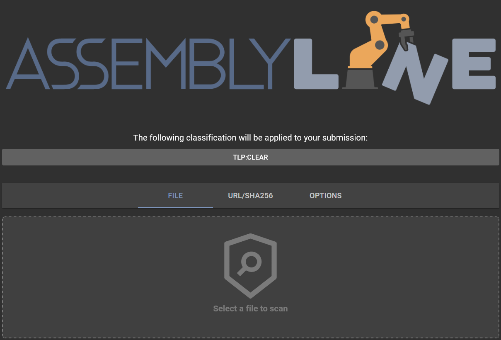

# Submitting a URL for analysis

## Submission
Submitting a URL for analysis is very similar to submitting a file; it can be done directly using the Assemblyline WebUI. For automation and integration you can use the [REST API](../../integration/python/#submit-a-file-url-or-sha256-for-analysis).

Just click on the "URL/SHA256" tab.

### Sharing and classification
If your system is configured with a sharing control (TLP) or Classification configuration, the available restriction can be selected by clicking on the Classification Banner.

### Choosing a URL to scan
Rather than dragging and dropping a file or selecting a file from your local drive, you input the URL that you want to scan by typing/pasting it into the "URL/SHA256 To Scan" text box and clicking "SCAN"!

### An important thing to note about URL submissions in Assemblyline
Since Assemblyline is a malware triage system, it starts every submission with a file, even if you submit a URL. The way that this works is if you submit a URL for analysis, Assemblyline will make a network request to the URL that you submitted, download the resource that is being hosted at that location, and submit that file for analysis. If there is no resource at the location anymore, or if Assemblyline cannot connect to the server where that URL was pointing, then the submission will fail.

This is important because if you have a URL hosting malware and you do not want to expose your Assemblyline system to that server that the URL is pointing to, then we recommend you set up a proxy server to act as a middleman between your Assemblyline infrastructure and the server hosting malware. You can set this up in your k8s deployment configuration under the [`ui` component](../..//odm/models/config/#ui). The item you are looking for is `url_submission_proxies`.

## Options
Additional submission options are available to:

- Select which service categories or specific services to use for the analysis
- Specify service configuration options (such as providing a password, or dynamic analysis timeout)
- Ignore filtering services: Bypass safelisting services
- Ignore result cache: Force re-analysis even if the same file had been scanned recently with the same service versions
- Ignore dynamic recursion prevention: Disable iteration limit on a file
- Profile current scan
- Perform deep analysis: Provide maximum deobfuscation (**Highly recommended for known malicious or highly suspicious files to detect highly obfuscated content**)
- Time to live: Time (in days) before the file is purged from the system

