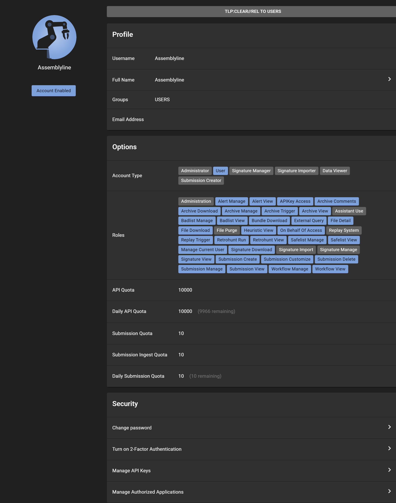

# User Interface Walkthrough for Users

Welcome to the Assemblyline User Interface Walkthrough. This guide is designed to help users navigate through the essential features and functionalities of the Assemblyline malware analysis tool. You will be acquainted with the main sections of the interface, including the landing page, account management, submissions, alerts, and how to perform searches.

## Landing Page

The landing page serves as the starting point to Assemblyline, providing a comprehensive overview and swift access to the primary features.

### Navigation and Layout

- **Side Menu**: The side menu, found on the left-hand side, is collapsible and features expandable options for ease of use.
- **Breadcrumb Navigation**: This helpful feature is located at the top, adjacent to the side menu, and helps you trace your navigational path.
- **Version Information**: If enabled, the Assemblyline version is conveniently displayed at the bottom near the side menu.

### Submission Section

The submission section is where you can take action and submit files, URLs, or hashes for comprehensive malware analysis.

-   **Classification Picker** (1)
    - Start by using the classification picker to set the appropriate classification level for your analysis.
    - Clicking the classification picker reveals the available options. (2)

-   **Submission Options** (3)
    -   Select the file or input the hash or URL you wish to analyze, then choose the type of analysis.
        - To adjust the predefined submission settings, select the "Tune" icon to customize the parameters as permitted.
        - If you're checking for pre-existing entries in the system, use the "Search" icon to perform a search and link to any existing data.
    -   Submit your entry by clicking the 'Submit' button.

1. 
2. 
3. 

For step-by-step submission instructions, please refer to the following guides:

- [Submitting a File](../../user_manual/submitting_file/)
- [Submitting a URL](../../user_manual/submitting_url/)
- [Submitting a SHA256 Hash](../../user_manual/submitting_sha256/)

### Additional Features

Maximize your efficiency with these useful tools integrated into Assemblyline.

-   **Search Bar**: Quickly locate specific items or information using the intuitive search bar. Simply click on the bar or use the shortcut `Ctrl+k` to focus on it. (1)

-   **Notification Panel**: Stay up to date with alerts and notifications by clicking the bell icon. Here, you will find system-wide announcements, updates, and even RSS feed integrations. (2)

-   **User Menu**: Personalize your experience in Assemblyline by clicking your avatar, located in the top-right corner. From here, you can switch between English and French localizations or toggle between dark and light interface themes. (3)

1. 
2. 
3. 

## Account Management

Navigate to the "Manage Account" section through the user menu for an overview of your profile details, such as security settings, account classification, and group memberships.

### Roles and Permissions

Control access and capabilities within Assemblyline with role-based access controls (RBAC). This system clearly defines permissions and available actions for each user role, enabling secure and orderly management of the system.

### API Quotas

Manage your engagement with Assemblyline's resources by understanding the quotas applied to your account. Check limits like simultaneous API interactions or concurrent submissions by clicking on "Manage Account" under your profile avatar.

### Account Security

Security features in the "Manage Account" section help safeguard your presence in Assemblyline:

-   **Multi-Factor Authentication (MFA)**: Strengthen your account security by enabling MFA.

-   **API Key Management**: Facilitate automated tasks by generating and managing API keys, which are crucial for scripting and tool integration with the Assemblyline API. To manage your keys, sign in, click your avatar, and go to "Manage Account." In the "Security" tab, find "Manage API Keys" to add, modify, or delete keys. For new keys, be sure to copy and securely store them immediately, as they will be shown only once.

## Account Settings

Customize your Assemblyline experience by adjusting your account settings. Click on the gear icon labeled "Settings" found near your avatar in the upper right corner. This section offers various settings related to your submissions and user interface preferences.

- **Save**: Click "Save" to apply new settings.
- **Cancel**: Reverts any changes to the previous state.
- **Reset**: Resets settings back to the system default values.

Remember, "Cancel" and "Reset" will not submit any changes, whereas "Save" is required to make your changes permanent.

### Interface Options

Tailor the Assemblyline user interface to suit your needs by configuring visual and file encoding settings:

- **File Encoding**: To download files without antivirus interference, set your preferred file encoding under "Interface Options." Select from safe formats like CaRT or password-protected ZIP to prevent automated deletions by antivirus software. (1)

1. 

### Submission Profiles

Choose from predefined Submission Profiles for your analyses. These profiles are crafted by system administrators to cater to various analysis needs. While personal profiles creation isn't permitted, users may adjust existing profile parameters according to their preferences.

- **Days to Live**: Default retention duration for your submissions within the system.
- **Classification**: Your default classification level for submissions, shaping data handling in accordance with your organization's policies.

#### Default Service Selection and Parameters

Set your default service preferences if you regularly use specific services for submissions, streamlining your process:

## Submissions

Oversee your submitted items through the "Submissions" option in the side menu:

### Submission Management

- **Filter Bar**: Refine your submission view using the filter bar to sort by certain criteria.
- **Preset Queries**: Filter submissions quickly by user, status, or threat level indicators.

### Submission Report View

Gain insights from detailed analyses by accessing the "Submission Report" view for a chosen submission, which presents a concise and informative summary.

## Alerts

Respond to critical findings effectively with Assemblyline's alert system. When submissions trigger defined conditions, alerts are raised to draw attention for further examination.

Set up alert generation for your submissions by selecting "Generate alert" within the "Settings" submenu under "Submission Options."

### Alerts Overview

Access a comprehensive view of all alerts on the "Alerts" page. This interface section enables you to view, filter, and manage alerts with ease.

### Filtering Alerts

-   When looking for specific alerts within Assemblyline, utilize the search bar at the interface's top or the general Search page. You can perform in-depth searches within the Alert index, honing in on security incidents by attributes such as threat indicators, classification, and timestamps. (1)

-   Set and access your favorite queries for repeated searches, saving you time and maintaining focus. (2)

-   Refine your search further by filtering query results, ensuring you concentrate on the most pressing alerts. (3)

1. 
2. 
3. 

### Workflow Actions

Define automated actions for alerts that meet certain conditions through workflows. For instance, mark all alerts labeled as malicious and containing "invoice" as "PHISHING."

There are two approaches on the Alerts page:

1.  **Create a Persistent New Workflow**: Click "Create a new workflow" to save a new named workflow within the system, applying it to future matching alerts. Manage these persistent workflows from the "Manage Workflows" page. (1)

2.  **Apply an Ephemeral Workflow Action Immediately**: Use "Workflow actions" for a one-time action applied to current alert matches; these are not saved as persistent workflows. (2)

1. 
2. 

Workflows empower you to:

- **Assign Status**: Define the alert status (e.g., MALICIOUS, NON-MALICIOUS).
- **Assign Priority**: Specify the alert's urgency (e.g., LOW, MEDIUM, HIGH).
- **Assign Labels**: Categorize the alert for organized management.

### Viewing Alert Details

Click on an alert card to display detailed information, aiding in thorough analysis and response.

Alert details cover:

- **Classification**: Alert's security level.
- **Basic Information**: Key data about the alert.
- **Verdict and Labels**: The assessed threat level and relevant tags.
- **File Details**: Information such as filename, type, size, and hashes.
- **Metadata and Indicators**: Additional data points and potential security flags.

### Alert Management Tools

Alert detail view presents essential tools for triage analysts (1)

- **View History**: Inspect the alert's change log.
- **Show All Alerts From Group**: Focus on alerts from the same category.
- **Take Ownership**: Claim the alert for case management.
- **Go to Related Submission**: Transition to connected submission details.
- **Perform a Workflow Action**: Execute predefined actions on group alerts.
- **Set Alert Verdict**: Overrule or confirm the system's threat assessment for accurate reporting

1. 

### Navigating Alerts

Cycle through alerts using the provided navigation arrows, allowing for quick view transitions.

## Enhanced Search Capabilities

Deepen your interaction with Assemblyline's data – for comprehensive instructions, head over to the [Searching in Assemblyline](../../user_manual/searching) documentation.
