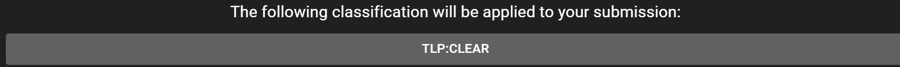
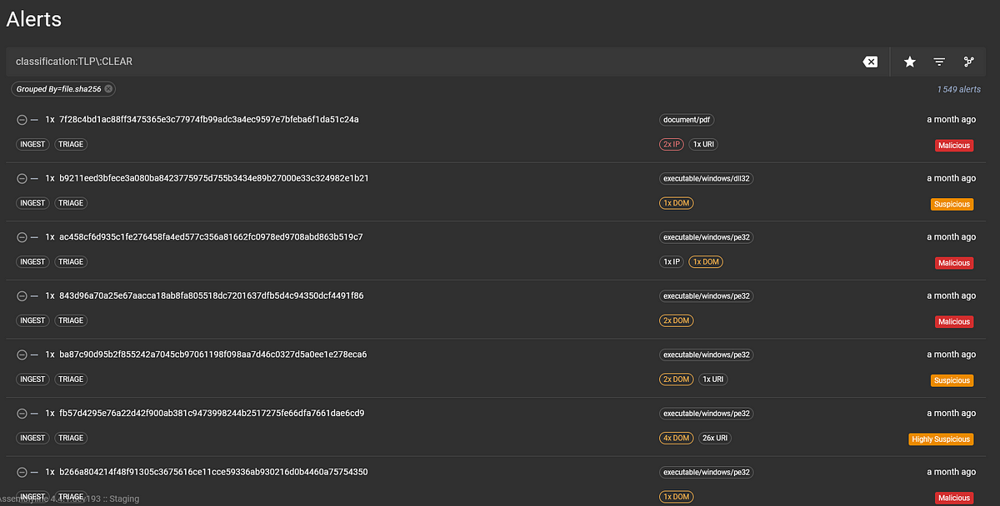

# User Interface Walkthrough for Users

## Landing Page

- There is a side menu on the left-hand side. It is collapsible.
- Some menu options expand to show you the sub-options for that topic
- There is a  breadcrumb section at the top next to the side menu, which is helpful for navigation.
- The version of Assemblyline that the core is running can be made visible as a configuration option and is seen at the bottom next to the side menu.
- The main middle area is the "submission" section
- You can specify the classification that you want for the submission via the classification picker:

Once you click on the classification picker, you get something like this:

You can submit a file, a URL, or a SHA256 hash, and specify the options that you want for the submission:

Select the following links to see the specifics about submitting [a file](../../user_manual/submitting_file/), [a URL](../../user_manual/submitting_url/) or [a SHA256 hash](../../user_manual/submitting_sha256/).

This is the search bar. You can click on it with your mouse or use Control + K to bring focus to it.

{: .center }

Clicking on the bell icon brings you to the notification panel where you can see system-wide announcements and what's new with the Assemblyline tool, as well as whatever RSS feeds that you have set up to receive:

{: .center }

Click on the avatar in the top right to view the user settings panel. Out of the box, Assemblyline supports English and French localization. You can also personalize some of the user interface experience here, such as dark mode vs light mode.

{: .center }

## Account Management and Settings
From the above menu, you can access the "Manage Account" view. This view has profile information like maximum account classification, groups your user is a part of, and personal details.

Assemblyline uses the concept of role-based access controls (RBAC) to perform fine-grained segmentation of certain features and capabilities within the system per user. As you can see from the below screenshot, my user is an administrator, so I can do anything I want with the system.

There are also quotas applied per user, such as the number of user processes interacting with the API at the same time and the number of parallel submissions running in the system. 

There are also some standard account security options in this view, like multi-factor authentication settings and API key management. API key management is a significant feature if you plan to interact with the Assemblyline API in an automated fashion, like with a script.

From the User Settings view, you can also navigate to the "Account Settings" view. These settings are mainly for if you use Assemblyline all the time and have certain preferences with how to interact with it. If you find yourself always selecting "Generate alert" on the submissions page, you can set a default value for that setting here, along with those of other settings.

"Days to live" and "Classification" are two settings that users tend to set defaults for since they are usually dictated by their organization.

Scrolling down in this view to the "Interface Options", you can set some more defaults.

The "File encoding" setting is of interest here, because if you are working on a system that has an antivirus product running on it, you will want to set the encoding of all files downloaded from the system to something like CaRT or a password-protected ZIP so that the files you download from Assemblyline are not immediately wiped from your machine.

{: .center }

Scrolling even further down, you can set a custom set of services as a default if you find yourself always submitting to the same services repeatedly.

Similar to setting a default service set, if you are always setting a default submission parameter value for a certain service, you can set that in the "Default Service Parameters Value" section.

## Submissions
We use the side menu option "Submissions" to bring us to the view consisting of submissions made to the system.

You can filter the submissions using the filter bar above the table of submissions. You can also filter on predetermined queries in this view by clicking on the icons on the right, such as all submissions associated with your user, all completed submissions, and all malicious submissions.

We can dive into a particular submission by selecting the submission card in the table. You will be brought to the "Submission Report" view.

The Report view is preferred if you want a condensed view of the analysis.

[Submission Report View](../../user_manual/results#submission-report)

## Alerts

An alert is a concept that is used in the Assemblyline malware analysis workflow. An alert is an object that is created when a submission meets a certain set of criteria (in most cases, exceeds a score threshold). These alerts can be assigned, triaged, and completed by analysts.

The "Alerts" page looks like this:

You can filter for alerts using a Lucene query:

You can set your favourite queries:

{: .center }

Filter the results after the query was made:

{: .center }

And apply workflow actions on alerts that already existed in the system:

{: .center }

An example of a workflow that you may want to perform is if you want all alerts that receive a verdict of malicious and contain the word "invoice" in the file name to be assigned a "PHISHING" label which can then be lumped into a bucket for further analysis.

{: .center }

By selecting an alert card on the "Alerts" page, you can view the full alert details:

You have the classification at the top, the alert information at the top left and the verdict and labels on the top right. After that, you have the file details like the name, type, size, and hashes. The metadata of the submission that raised this alert follows that as well as any indicators of compromise or heuristics that were found.

If you have a team of analysts triaging alerts as we do at the Canadian Centre for Cyber Security, these buttons on the top right of the alert details view are very important:

{: .center }

We'll explain them from left to right.

The suitcase icon button is "View History". If you click on that you can see the history of the alert, such as if an analyst has completed this alert or if any labels have been applied:

The next button is "Show all alerts from group", which will apply a group filter to the query on the Alerts page to show you all the alerts from the same group as the alert you are viewing:

{: .center }

Then there is the "Take ownership" option which will allow you to assign the alert to your user account so that a team of analysts can easily assign work:

{: .center }

The next options are "Go to a related submission" which will bring you to the submission that raised that alert, and "Perform a workflow action", where you can create a workflow action to be applied to all alerts in the system that are part of the same group. 

The following options are "Set alert verdict to non-malicious" and "Set alert verdict to malicious", which provide the ability of an analyst to assign a verdict to complement the system verdict. This is useful if Assemblyline provides a false-positive verdict and the analyst confirms that the alert is a false-positive, then the analyst can say "Hey this is a false-positive" by using the corresponding button.

The last two options are arrows for easily navigating through alerts.

## [Searching in Assemblyline](../../user_manual/searching)
