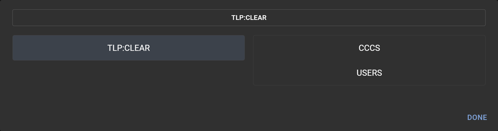
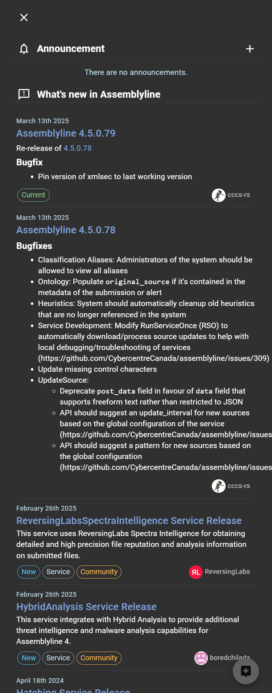
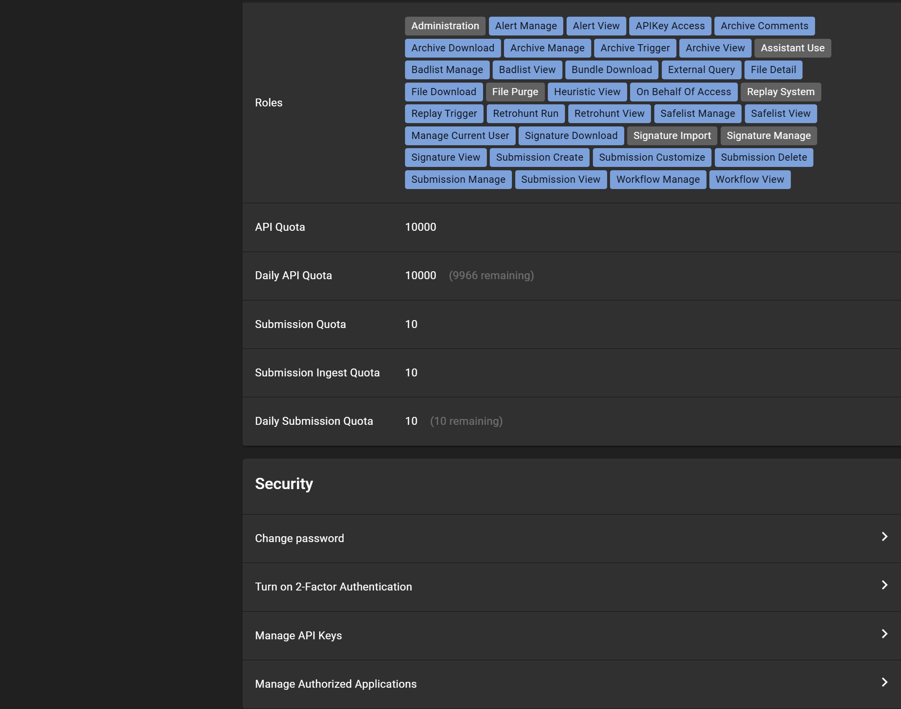

# User Interface Walkthrough for Users

Welcome to the Assemblyline User Interface Walkthrough, designed to guide users through the essential features and functionalities of the Assemblyline malware analysis tool. This document will cover the main sections of the interface, including the landing page, account management, submissions, alerts, and searching.

## Landing Page

The landing page is your starting point in Assemblyline, offering a comprehensive overview and quick access to primary features.

### Navigation and Layout
- **Side Menu**: Located on the left-hand side, the side menu is collapsible and contains expandable options.
- **Breadcrumb Navigation**: Found next to the side menu on top, aiding in navigation.
- **Version Information**: Displayed at the bottom next to the side menu if enabled, showing the Assemblyline version.

### Submission Section

At the heart of Assemblyline's functionality is the submission section, where users can submit files, URLs, or hashes for malware analysis. This section is central to the interface, allowing users to initiate the analysis process quickly and efficiently.

- **Classification Picker**: Before making a submission, you can use the classification picker to specify the desired classification level for your analysis.

  

  Once clicked, the classification picker will expand to display available options.

  

- **Submission Options**: Here, you can submit a file, a URL, or a SHA256 hash. Additionally, you can specify various options to tailor the submission to your needs.

  

  For detailed instructions on how to make a submission, refer to the specific guides:
  - [Submitting a File](../../user_manual/submitting_file/)
  - [Submitting a URL](../../user_manual/submitting_url/)
  - [Submitting a SHA256 Hash](../../user_manual/submitting_sha256/)

### Additional Features

- **Search Bar**: Use the search bar to quickly locate information. Click on it or use `Ctrl+k` to focus on the search bar.

  {: .center }

- **Notification Panel**: Click the bell icon to access the notification panel, where you can view system-wide announcements, updates, and RSS feeds.

  {: .center }

- **User Menu**: Click your avatar in the top right corner to access the user configuration panel. Assemblyline supports English and French localization and allows you to personalize your user interface experience, including toggling between dark mode and light mode.

  {: .center }

## Account Management

From the user menu, you can access the "Manage Account" view. This section contains your profile information, including your maximum account classification, group memberships, and personal details.

Here is the first part of the "Manage Account" view:

Scroll down a bit to see the second part of the "Manage Account" view:

### Roles and Permissions

Assemblyline uses role-based access controls (RBAC) to manage user permissions. Roles define what actions users can perform in the system, ensuring fine-grained control over functionalities.

### API Quotas

Each user has specific quotas applied to their account, such as the number of processes interacting with the API simultaneously and the number of parallel submissions. These quotas help manage system resources effectively. To view quotas related to your account, select your avatar in the upper right corner and click on the icon labeled "Manage Account".

### Account Security

Account security is important in Assemblyline. The "Manage Account" view provides several security options:
- **Multi-Factor Authentication (MFA)**: Enhance security by enabling MFA.
- **API Key Management**: Generate and manage API keys, essential for automated interactions with the Assemblyline API via scripts or other tools. You can manage your API keys by logging into Assemblyline's user interface, clicking on your avatar in the top-right corner and selecting "Manage Account." Then, scroll down to the "Security" section and select "Manage API Keys." From there, you can add a new API key, specify its name and access privileges, and click the "Add" button. Remember to copy the API key somewhere safe as it will only be displayed once.

## Account Settings

To adjust your account settings, navigate to your avatar in the upper right corner of the screen and select the gear icon that is labelled "Settings". Here, you will find settings related to submission options, interface options, default file sources, default service selection, and default service parameters:

### Submission Options
Set default values for frequently used submission settings to streamline your workflow. For example:
- **Days to Live**: Specify the default number of days that submissions will be retained in the system. This is crucial for managing data lifecycle and compliance with organizational policies.
- **Classification**: Set a default classification for your submissions, ensuring they adhere to your organization's data handling requirements.

### Interface Options
Configure interface preferences, including visual settings and file encoding options, to optimize your user experience:

  

- **File Encoding**: Assemblyline allows users to download files to their host system without triggering antivirus. Prior to downloading your first file, navigate to the avatar in the upper right corner, select the gear icon labelled "Settings", and locate the section labelled "Interface Options." There, you will be able to choose your preferred file encoding option. This setting is important for environments with antivirus software, as it allows you to set the encoding of files to formats like CaRT or a password-protected ZIP to prevent antivirus software from immediately deleting them

  

#### Default Service Selection
If you often submit to the same services, set a default service set and default service parameters to save time:
  
  

## Submissions

Use the side menu option "Submissions" to view and manage all submissions made to the system.

### Filtering and Viewing Submissions

- **Filter Bar**: Use the filter bar above the table to narrow down your submissions.
- **Preset Queries**: Use icons to filter by user, completed submissions, or malicious submissions.

### Submission Report View

Dive into a particular submission by selecting its card in the table, bringing you to the ["Submission Report" view](../../user_manual/results#submission-report). This view provides a condensed report of the analysis, offering a streamlined summary that is easier to digest.

## Alerts

An alert in Assemblyline is a notification generated when a submission meets certain criteria, often exceeding a predefined score threshold. Alerts are created based on post-process actions that define what justifies an alert. They can be managed, assigned, triaged, and resolved by analysts. Alerts contain specific information such as import tags, heuristic triggers, MITRE ATT&CK matrix categories, submission metadata, file information (hashes, size, type, name), and alert-specific details like timestamps, verdicts, owner, labels, priority, and status. The alerting process involves components like the Dispatcher, Alerter, and Workflow, which work together to evaluate rules, create alert messages, transform submissions into alerts, and apply user-defined workflows for categorization and prioritization.

To generate alerts for your submissions, navigate to the avatar in the upper right corner, select the gear icon labelled "Settings", and under "Submission Options" click the "Generate alert" button.

### Alerts Overview

The "Alerts" page provides a comprehensive view of all alerts. You can view, filter, and manage alerts effectively using the built-in tools.

### Filtering Alerts

You are able to search and filter for alerts that already exist in Assemblyline. This is possible by using the search bar at the top of the user interface or the generic Search page to perform searches across all indices, including the Alert index. The Alert index allows you to perform detailed searches on alerts to quickly identify and prioritize security incidents based on various attributes such as threat indicators, classification, and timestamps.

Additionally, you can set your favorite queries for quick access. This makes it easier to run frequently used searches without re-entering the criteria each time.

{: .center }

After performing a query, you can further filter the results to hone in on the most important alerts.

{: .center }

### Workflow Actions

Workflows allow you to automate specific actions on alerts based on predefined criteria. For example, you might want to label all alerts with a verdict of malicious and containing the word "invoice" as "PHISHING" for further analysis.

From the Alerts page, you can perform two types of workflow actions:

1. **Create a Persistent New Workflow**: Click the "Create a new workflow" button. This option allows you to add a new named workflow to the system. When creating a new workflow, you can specify if it should be applied to all existing alerts that match the supplied filter. Once created, this workflow is saved and will continuously be applied to any new alerts that match the criteria. The workflow persists in the system and can be managed from the "Manage Workflows" page.

   {: .center }

2. **Apply an Ephemeral Workflow Action Immediately**: Click the "Workflow actions" button to apply a new workflow action to existing alerts based on the current query filter. Unlike creating a new persistent workflow, this action is not saved as a workflow in the system. Instead, it is a one-time action that is only applied to matching existing alerts.

   {: .center }

Within a workflow action, you can assign various actions to alerts that meet the criteria:
- **Assign a Status**: Set the status of an alert (e.g., MALICIOUS, NON-MALICIOUS, ASSESS, TRIAGE).
- **Assign a Priority**: Set the priority level of the alert (e.g., LOW, MEDIUM, HIGH, CRITICAL).
- **Assign a Label**: Apply a label to categorize the alert (e.g., PHISHING, FALSE_POSITIVE, etc.).

These workflow actions ensure alerts are handled consistently and according to your organization's policies.

### Viewing Alert Details

Select an alert card to view detailed information about the alert:

The alert details include:
- **Classification**: The classification level of the alert.
- **Alert Information**: Basic information about the alert.
- **Verdict and Labels**: The system's verdict and applicable labels.
- **File Details**: Information about the file, including name, type, size, and hashes.
- **Metadata and Indicators**: Metadata and any indicators of compromise or heuristics found.

### Alert Management Tools

Within the alert details view, triage analysts have several important tools at their disposal:

{: .center }

- **View History**: Check the audit history of an alert, displaying all changes made to the alert. This includes changes related to priority, status, and the addition or removal of labels. Each change is timestamped and indicates whether the change was made by a workflow or a user.

  

- **Show All Alerts From Group**: Apply a filter to the current query to view all alerts from the same group as the selected alert.

  {: .center }

- **Take Ownership**: Assign the alert to your user account for triage.

  {: .center }

- **Go to Related Submission**: To see any submissions that are related to an alert, select "Alerts" on the menu on the left side of the screen and select a relevant alert. Then, in the upper right corner of the screen, click the "Go to related submissions" icon.
- **Perform a Workflow Action**: Apply a workflow action to alerts in the same group.
- **Set Alert Verdict**: Manually set the alert verdict to non-malicious or malicious. This feature provides analysts with the ability to complement the system verdict. It is especially useful in cases where Assemblyline provides a false-positive verdict, allowing the analyst to confirm and mark the alert as a false-positive, and vice versa.

### Navigation Arrows

Navigate through alerts easily with the left and right arrows to cycle through available alerts.

## Searching in Assemblyline

For detailed information on searching, refer to the [Searching in Assemblyline](../../user_manual/searching) section.
