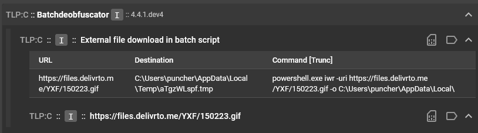
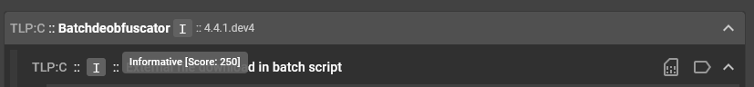
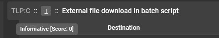
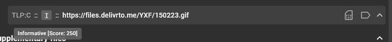
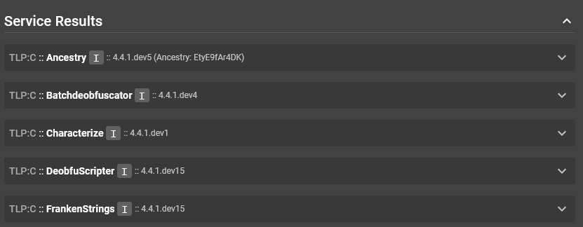
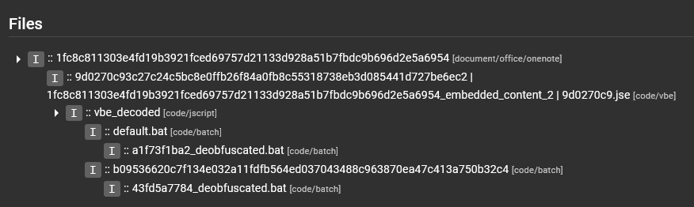
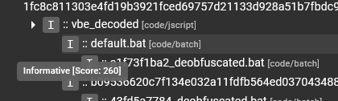
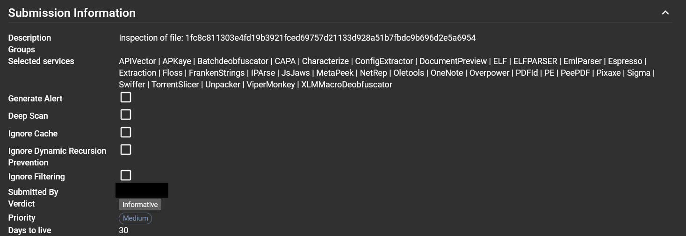
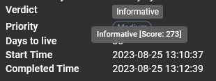
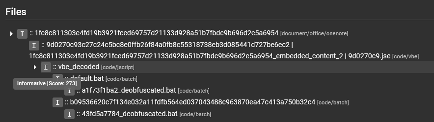

# Assemblyline Verdicts

As per the [Assemblyline documentation](../../odm/models/config/#verdicts), verdicts are the human-readable
interpretation of the score that a file received upon analysis by a service.

By default, the following score ranges are applied to certain verdicts:

```
-1000: safe
0 - 299: informative
300 - 699: suspicious
700 - 999: highly suspicious
>= 1000: malicious
```

## How the scores are calculated

Scores are generated by heuristics raised by a service. To see the score for a specific result in your Assemblyline submission, hover over the relevant verdict "button" in the service results section. These buttons will either have a grey "I", yellow "S", or red "M" to represent their respective result verdicts.

For example, here is the result from the Batchdeobfuscator service:



You can see that there are three different square buttons with an "I" in this view. These buttons represent the verdicts ("I" stands for "Informative"), but each for different things. The top-most button, next to the service name, represents the service score, which is a summation of all the heuristic scores for all heuristics in the service result.

By hovering over this "I" button, we can see that the service score is 250:



Next we hover over each of the "I" buttons for the result sections within the result. The first result section has a score of 0:

{: .center }

And the second result section has a score of 250:



These two scores are added together to give us the service score next to the service name.

Next, we pan out and look at all of the service results for that particular file, including the Batchdeobfuscator result:



You can hover over these "I" buttons and see that the only other service that had a service score greater than 0 was DeobfuScripter, which had a score of 10:


Service scores for a single file are added together to create a total score for that file.

Panning out even more to the "Files" section of the overall submission:



We were looking at the service results for the `default.bat` file, and based on what we just discussed, we expect this score to be 260. We hover over the "I" button next to the file name and see that this is confirmed:

{: .center }

The next area where scores are applied is for the overall submission. The submission looks at all scores for all files in the "Files" section, and takes the maximum score found there to be the score to represent the overall submission. The submission verdict is displayed in the "Submission Information" section of the "Submission Details" page.



We can hover the verdict button to see the score that rendered this verdict:

{: .center }

Interesting, I guess the `default.bat` file that scored 260 was not the highest scoring file in the "Files" section.

By hovering over the other files in the section, we see that the `vbe_decoded` file is actually the highest scoring file, with a score of 273:



Since that is the highest scoring file in the submission, the overall submission score is set to that file's score.

## How heuristic scores are assigned

Heuristics in a service are assigned an arbitrary score by the service writer. 
If the score of a heuristic is less than 500 (which would flag the file as suspicious), then the intention of the service writer is for this heuristic score to be compounded with the scores of other heuristics in the service result before the verdict of the file is deemed suspicious or worse. 

If the heuristic score is 1000 or above, then this heuristic is a high-confidence heuristic that can be trusted to flag a file as malicious with little to no false positives. Heuristics like these are found in signature-based services like AntiVirus, Intezer, ConfigExtractor, VirusTotal and Yara, to name a few.

If the heuristic score is between 500 and 1000, then the service writer is relatively confident that this file has a feature that is suspicious or even highly suspicious, but cannot confirm that the file is definitely malicious.

## Interpreting the verdict

Now that we have covered the fundamentals of scoring and where verdicts come from, let's get into the reason why we are all here:

> "HELP I HAVE A FILE THAT ASSEMBLYLINE SAYS IS MALICIOUS! I'VE BEEN COMPROMISED! NOOOOOOOOOOOOOO"

1. First things first, stay calm. Assemblyline has been known to give false positive results in the past, and this could be an example of this. 
2. Dive into the details of the submission. Which file is being scored the highest in the "Files" section?
3. Dive deeper into the analysis results for this file. Which services were scoring the highest? Remember, these scores would then be added together.
4. Dive even deeper into the services that are scoring the highest. Which heuristics are scoring the highest? Based on their scores and how we know scores are arbitrarily assigned to heuristics by service writers, do we think they are accurate?

After you have performed the steps mentioned above, are you confident that the file is a true positive or a false positive? If the file is a false positive, please raise this to the relevant service writers so that they can adjust the heuristic scores or tweak the service to avoid this.
